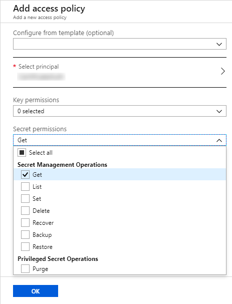

# Certificate Based Authentication with Azure Functions/Key Vault

## Introduction
There are two main ways to main ways to perform OAuth authentication using the client credentials flow: client secret and certificate. People most commonly use the client secret option as it is much easier to implement -- you create a new secret on the App Registration and you can use it.  However, certificate based authentication is generally considered to be more secure than using a client secret (which is effectively just a password).  It seems that most people shy away from using certificates for authentication because of the perceived complexity in using them.  However, in this blog, we'll show that it is actually very easy to maintain self-signed certificates in an Azure Key Vault and use them to connect to Dynamics 365 through an Azure Function.

## Configuration

In order to wire this up, we need to configure a few resources in Azure.

### Azure Key Vault

This is where we will create and store the self-signed certificate.

1. Create a new Key Vault resource.
2. Go to Certificates > Generate/Import
   - Set the Certificate Name
   - Set the Subject, can be anything
   - Click `Create`  
     
3. After the certificate has generated, export it
   - Download in CER format
   - Copy the `Secret Identifier` from the bottom of the page  
     

### Azure Active Directory

We need to register a new application in Azure AD and configure the certificate on it.  This is the application that our Azure Function will authenticate to.

1. Go to Azure Active Directory > App Registrations
1. Click `New Registration`
   - Give it a Name, you can leave the Redirect URI blank
1. Copy the Application (client) ID value
1. Click on `Certificates & secrets`
   - Upload the .cer file you downloaded above  
   

### Dynamics 365

Next, we need to configure an Application User in Dynamics 365.  This user is mapped to the Azure AD App Registration, and it is granted a security which controls what the user can access.

1. Go to Settings > Security > Users
1. Switch the view to `Application Users`
1. Create a new User
   - Switch to the `Application User` form
   - Populate the `Application ID` with the `Application ID` from the App Registration
1. Assign a security role to the user


### Azure Function

Finally, we deploy the Azure Function which will use the certificate from the Key Vault to connect to our Dynamics 365 environment.  The Azure Function uses a system 

1. Deploy the Azure Function
   - See the next section for the code
1. Go to Platform Features > Identity
   - Turn the System Assigned identity to `On`  
   
1. Go back to the Azure Key Vault.
   - Click on Access Policies > Add New
   - Select the principal that matches the managed identity of the Azure Function (should have the asme name)
   - Grant it "Get" access for "Secret permissions"
   - Click OK  
     
1. Go back to the Azure Function
1. Open the Configuration/Application Settings
1. Set the "Certificate" application setting, replacing URI with the Secret Identifier you copied above.
   - `@Microsoft.KeyVault(SecretUri=https://bguidinger.vault.azure.net/secrets/CertificateName/VersionNumber)`  
   


## Development

The code for the Azure Function can be found here.

In the function, first we pull the configuration values from the Function.  This includes the `Certificate` setting which has the Base64 encoded certificate (with the public and private key).

```
var certificateString = ConfigurationManager.AppSettings["Certificate"];
var certificateBytes = Convert.FromBase64String(certificateString);
var certificate = new X509Certificate2(certificateBytes, string.Empty, X509KeyStorageFlags.MachineKeySet);
```

Once we have the certificate, we can use it with the `CrmServiceClient`.  Note that the second and third parameters (certificate store/thumbprint) are not required since we are directly passing the certificate in.

```
var client = new CrmServiceClient(certificate, StoreName.My, null, instanceUri, true, null, clientId, null, null)
```

Once we have the `CrmServiceClient`, we can check the `IsReady` parameter to make sure we connected successfully.  If it's `true` then we're connected to CRM!

## References
1. [Use OAuth with Common Data Service - Connect as an app](https://docs.microsoft.com/en-us/powerapps/developer/common-data-service/authenticate-oauth#connect-as-an-app)


1. [Use Key Vault references for App Service and Azure Functions ](https://docs.microsoft.com/en-us/azure/app-service/app-service-key-vault-references)
